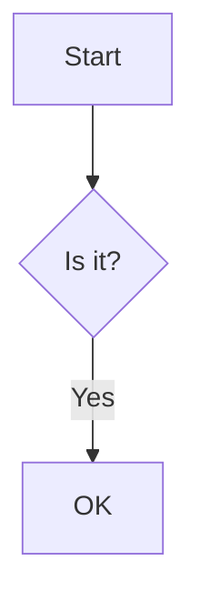

# Diagrams and math


```mermaid
graph TD
  A[Start] --> B{Is it?}
  B -->|Yes| C[OK]
```

Inline math $E = mc^2$ and a block:

$$
\int_0^1 x^2 \, dx = \frac{1}{3}
$$

Code math: $`a^2 + b^2 = c^2`$

```math
\sum_{i=1}^{n} i
```
